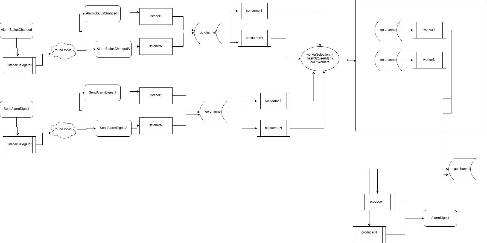

## Alarm Digest Service

##### Nikolaos Christidis (nick.christidis@yahoo.com) :: Used --> go 1.17rc2

### Description - Technical decisions


The core logic of the alarm service is separated in the following 'components':


* `Producers` - which produce message to nats topic (in our case the AlarmDigest topic where we
  send the alarms of the user after a 'flush' from a SendAlarmDigest message).

* `Listeners` - which listen for messages from nats topics (in our case AlarmStatusChanged and SendAlarmDigest topics)
and propagate them to consumers through go channels for further processing.

* `Consumers` - listen for messages on go channels (which got emitted from listeners (from nats topics)), calculate the distribution worker id
in order to propagate the message to worker's channel for processing from worker so to distribute the load and scale.
In our case the distribution worker id is calculated: `workerId <= hash32(userId) % totalNumberOfWorkers`.
`totalNumberOfWorkers` are the goroutines which run the worker code-logic.
So we can say that consumers are light processors and act as routers based on the message's user id

* `Workers` - listen for messages to process on its own go channel, messages there are processed based on their type
  * `AlarmStatusChanged message` --> updates the state of the worker
  * `SendAlarmDigest message` --> if any critical alarms for the user it will send to a dedicated go channel which eventually
    will be picked from Producers and emit these to AlarmDigest topic.


* Some notes:
  * The approach for all components was share-nothing approach, and all go routines communicate with channels.
    No mutexes-locks have been used (in order to avoid bottlenecks and scale, etc.)
    Moreover, Go does not have sophisticated concurrent datastructures (eg: CompareAndSet) out of the box, so channels is
    definitely the way to go in terms of concurrency - work splitting.
  
  * Worker component has its own local-state (maps, etc.), so it is somehow an actor which a go channel plays the role of its mailbox,
    and listens there for incoming tasks.


* Diagram:




#
#


### Improvements 

#### Persistence
As stated in the exercise messages should always be delivered and not lost.
NATS is a fire and forget infra (`Core NATS is a fire-and-forget messaging system, will only hold messages in memory and will never write messages directly to disk.`), 
meaning that is not backed-up from persistence, so to store messages and
when the consumer-listener is up to pull/push.

Moreover, if the alarm-service goes down (eg: due to panic) during send of AlarmDigest, these alarms will be lost, because 
alarm-service is stateless.

So for this reason, when we consume from NATS we should store
to a persistent storage (in our case Cassandra seems a very good fit - write intensive db due to LSM tree).
Eg: a good designed table key could be like `key(partitionKey(userId, alarmId, status) - clustering key(updatedAt order by desc))`


So when we consume we store, worker processes the message, and during flush with SendAlarmDigest, cleans the necessary
database records for housekeeping stuff.


#
#


### How to run (needs to run nats-server first - check related section)

* First: `cd alarm/`
* Then: `go run .` OR (`go build .` and `./alarm`)


### How to run tests (needs to run nats-server first - check related section)
* First: `cd alarm/`
* Then: `go test ./...`
* You should see the following:
```text
chriniko13@chriniko13:~/GolandProjects/netdata_christidis_nick/alarm$ go test ./...
warning: GOPATH set to GOROOT (/home/chriniko13/sdk/go1.17rc2) has no effect
ok      alarm   0.755s
?       alarm/domain    [no test files]
?       alarm/error     [no test files]
?       alarm/fileutil  [no test files]
ok      alarm/hashing   0.001s
ok      alarm/message   0.002s

```


### How to run benchmark

* Execute: `cd alarm/` and `go test -run=BenchmarkTest -bench=.`
  You should see the following output:
  ```text
  goos: linux
  goarch: amd64
  WARN[0004] [SendAlarmDigest#Delegator] bad formatted message received from topic: SendAlarmDigest, data: {"UserID":"65396a05-ff57-11eb-a37e-d8bbc1068e57"}
  pkg: alarm
  cpu: AMD Ryzen 5 5600X 6-Core Processor             
  BenchmarkTestBootstrapAlarmService_1-12         INFO[0004] [alarmMessagesWorker#14] WORKER RECEIVED AlarmStatusChangedMessages message: {653e1290-ff57-11eb-a384-d8bbc1068e57 653e1292-ff57-11eb-a384-d8bbc1068e57 CRITICAL 2021-08-17 15:33:59 +0300 EEST}
  WARN[0004] [AlarmStatusChanged#Delegator] bad formatted message received from topic: AlarmStatusChanged, data: {"AlarmID":"653e11d3-ff57-11eb-a383-d8bbc1068e57","ChangedAt":"2021-08-17T15:33:59+03:00","Status":"CRITICAL","UserID":"653e11d4-ff57-11eb-a383-d8bbc1068e57"}
  INFO[0004] [sendAlarmDigestTopicListener#9] message received from topic: SendAlarmDigest.9, data: {65372b78-ff57-11eb-a37e-d8bbc1068e57}
  1        4587239464 ns/op
  INFO[0004] [sendAlarmDigestConsumer#11] SendAlarmDigestMessage received: {65372b78-ff57-11eb-a37e-d8bbc1068e57}
  WARN[0004] disconnected from the server id:  --- error: <nil>
  PASS

  ```

#
#

### Installing Log
```text
go get "github.com/Sirupsen/logrus"
```


### Installing UUID library
```text
go get github.com/google/uuid
```


### Installing nats libraries
```text

# Go client
go get github.com/nats-io/nats.go/

# Server
go get github.com/nats-io/nats-server

```


#
#


### Setting up provided nats-server and verification tool
* nats server and verification tool
```dockerfile
docker run -p 4222:4222 --rm -it \
--name be-challenge \
docker.io/lvrach/be-challenge:latest

```

* then run service


* then execute the verification tool as following
```dockerfile
docker exec -it be-challenge verify
```

* so the output if all okay should be the following
```text
chriniko13@chriniko13:~/GolandProjects/netdata_christidis_nick$ docker exec -it be-challenge verify
2021/08/16 22:38:20 waiting to consume "AlarmDigest" messages
2021/08/16 22:38:20 Smoke test passed

```
